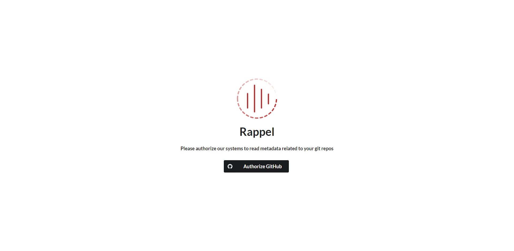
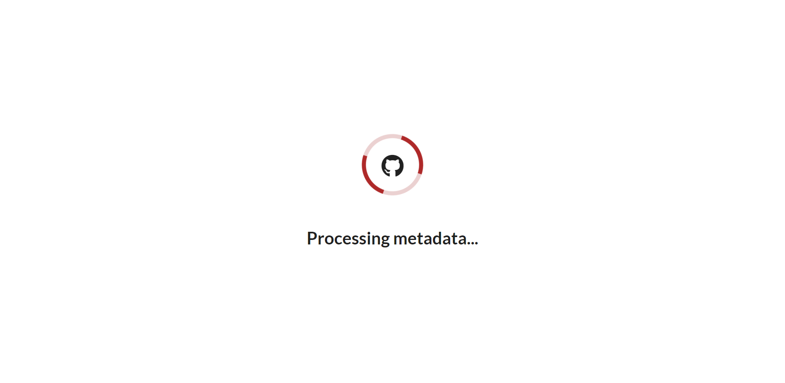
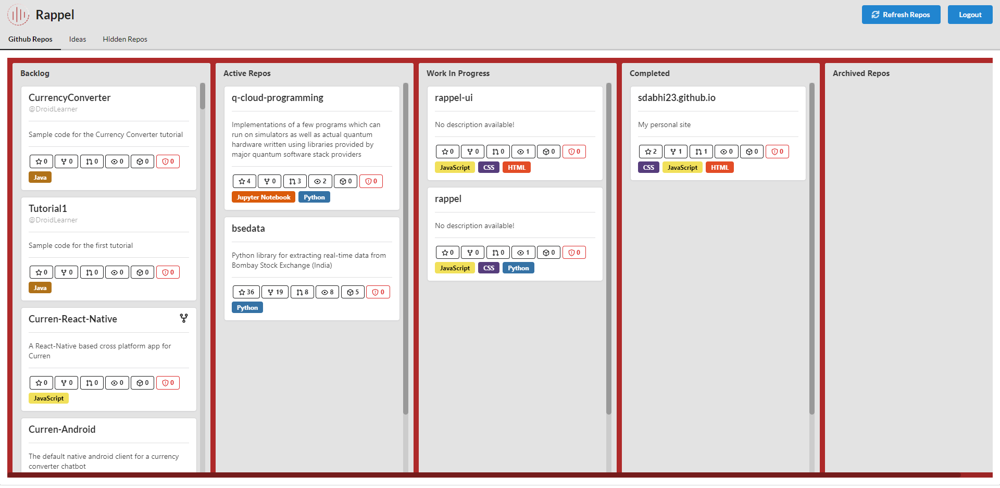

# Rappel

An idea management tool, inspired from kanban boards and integrated with GitHub

This repo only contains the frontend for the app. Please check [sdabhi23/rappel](https://github.com/sdabhi23/rappel)

## Features

- Automatically sync your GitHub repos
- Sort the repos into 5 categories:
  1. Backlog
  2. Active
  3. Work In Progress
  4. Done
  5. Archive
- Add working notes for the repos directly inside their cards

## Roadmap

- Add notes for new ideas
- Filter repos
- Search repos
- Hide stale repos into a separate tab
- Automatically delete repos when they are deleted from GitHub
- Integration with PyPI and NPM
- Integration with GitLab

## Run locally

- Install dependencies

  ```bash
  ➜ npm install
  ```

- Run the app locally

  ```bash
  ➜ npm start
  ```

The api docs should be available at <http://localhost:8000/api/schema/redoc/>

## Screenshots

- Homepage

  

- Authorize GitHub

  

- GitHub Callback

  

- Dashboard

  
